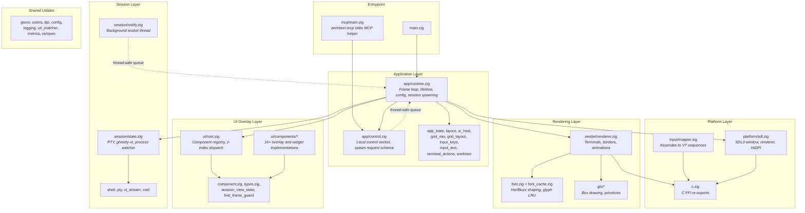

# Architecture

## System Overview

Architect is a **single-process, layered desktop application** built in Zig that functions as a grid-based terminal multiplexer optimized for multi-agent AI coding workflows. It follows a five-layer architecture: a thin entrypoint delegates to an application runtime that owns the frame loop, platform abstraction (SDL3), session management (PTY + ghostty-vt terminal emulation), scene rendering, and a component-based UI overlay system. The UI and terminal loop run on the main thread; background threads are used only for bounded auxiliary work (notification socket listener, local control socket listener, and quit-time agent-teardown worker). The frame loop uses a wakeable wait model: active work continues at the normal frame cadence, while idle frames block in SDL until either a wake-worthy event arrives or the next idle deadline expires. The application uses an action-queue pattern for UI-to-app mutations, request queues for external socket inputs, epoch-based cache invalidation for efficient rendering, and a vtable-based component registry for extensible UI overlays. Renderer cache entries are reused for both grid tiles and the steady-state full-screen terminal view; overlays remain live unless an effect needs them baked into the cached texture.

## Component Diagram



## Dependency Rules

Dependencies flow strictly downward through the layer stack. No upward or lateral dependencies between peer layers except through the Application layer.

```
Entrypoint
    |
    v
Application Layer  (app/runtime.zig orchestrates everything below)
    |
    +-----------+-----------+-----------+
    |           |           |           |
    v           v           v           v
Platform    Session    Rendering    UI Overlay
    |                     |           |
    v                     v           v
              Shared Utilities
```

**Invariants:**
- Session, Rendering, and UI Overlay layers never import from each other directly. All cross-layer communication flows through the Application layer or shared types.
- UI components communicate with the application exclusively via the `UiAction` queue (never direct state mutation).
- Background threads are intentionally limited to three cases: the notification socket listener (`session/notify.zig`), the local control socket listener (`app/control.zig`), and a quit-time agent-teardown worker in `app/runtime.zig`. They communicate completion/state back to the main thread through thread-safe primitives. The notification and control listeners also post a custom SDL wake event after queueing work so the idle frame loop breaks out of `SDL_WaitEventTimeout(...)` promptly.
- Shutdown order is UI-first for teardown dependencies: `UiRoot.deinit()` runs before session teardown so components that reference sessions are released while session memory is still valid.
- Runtime uses a one-shot teardown guard around UI cleanup so mixed `errdefer`/`defer` error unwind paths cannot deinitialize `UiRoot` twice.
- Runtime persistence is updated during the frame loop when runtime state changes (cwd changes, terminal spawn/despawn, window move/resize, font size changes), and finalization is explicit at the end of `app/runtime.zig`: final save and deinit `Persistence` before deferred subsystem teardown begins.
- Font reload paths are transactional: acquire both replacement fonts first, then swap and destroy old fonts, so a partial reload failure cannot leave deinit hooks pointing at already-freed font resources.
- Window-resize scale handling follows a single ordered path (`reload-if-needed`, then `resize`) to keep behavior consistent between changed-scale and unchanged-scale events.
- Terminal resizes use Ghostty's minimal flow: a single `ioctl(master, TIOCSWINSZ)` on the PTY master, which the kernel pairs with a SIGWINCH to the foreground process group of the slave's controlling terminal. Each session is sized independently. The focused session in `.Full`/`.Expanding`/`.Collapsing` mode (and additionally the previous session during a panning transition) is sized to the full-window cell count; every other session stays at grid-cell size. Grid↔full view toggle therefore reflows exactly one session — the one the user actually zoomed — instead of every session in the workspace. Window resize, font size change, and grid layout change all flow through the same per-session dispatch (`fullSetForMode` in `app/runtime.zig`, `applyTerminalResize` with `Sizes`/`FullSet` in `app/layout.zig`). Grid sizing accounts for the user's grid font scale and the reserved CWD-bar space when computing tile cell count. Grid-view text is rasterized by a second, non-owning `Font` opened from `shared_font_cache` at the grid's native cell size (`layout.gridFontSize`, rebuilt before render when the size or cache generation changes) and rendered near scale 1.0, so small grid text stays crisp instead of being GPU-downscaled from the base font. While DEC mode 2026 (`\e[?2026h`) is active for a session, the renderer reuses the last cached texture for that session via `synchronizedOutputHoldsCache` in `render/renderer.zig` instead of refreshing from the in-progress vt model, so reflows from agents like Codex appear as one atomic frame change rather than a top-to-bottom rescroll. The hold is dropped when the cached composition mismatches the requested one (an overlay or wave needs to bake into the next frame) or when the app sends the closing `\e[?2026l`; the next frame after the close refreshes once and snaps to the final state. A timeout-based safety net in `session/state.zig` force-clears the mode if a session leaves `\e[?2026h` set without ever closing it.
- Shared Utilities (`geom`, `colors`, `dpi`, `config`, `logging`, `metrics`, etc.) may be imported by any layer but never import from layers above them.
- **Exception:** `app/*` modules may import `c.zig` directly for SDL type definitions used in input handling. This is a pragmatic shortcut for FFI constants, not a general license to depend on the Platform layer.

## Rules for New Code

These patterns are mandatory for all new code. They are derived from the architectural decisions (see ADRs below) and exist to prevent the most common structural violations.

1. **UI components use the vtable interface and communicate via UiAction queue.** Never mutate application state directly from a UI component. Push a `UiAction` to the queue; the main loop drains it after all component updates complete. (See ADR-003.)

2. **Render invalidation uses epoch comparison.** When terminal content changes, increment `render_epoch` on the `SessionState`. The renderer checks whether `presented_epoch` no longer matches `render_epoch` to know whether a session needs to be redrawn this frame, and cached session textures refresh when their stored epoch, overlay composition, or grid/full render mode no longer matches the requested render. This applies to both grid tiles and the steady-state full-screen terminal view. Never force a full re-render. (See ADR-004.)

3. **Blocking I/O goes on a background thread with a thread-safe queue.** The frame loop must never block. Any new external I/O source must follow the notification/control socket pattern: background thread + queue + main-loop drain. (See ADR-009.)

4. **Config vs. persistence separation.** User-editable preferences go in `config.toml`. Auto-managed runtime state (window position, recent folders, terminal cwds) goes in `persistence.toml`. Never mix them. (See ADR-010.)

5. **Use FirstFrameGuard for visibility transitions.** When a UI component moves to a visible state (modal opens, toast appears), call `markTransition()` and return `guard.wantsFrame()` from the component's `wantsFrame` method to bypass idle throttling. (See ADR-012.)

## Where to Put New Code

| I need to...                        | Put it in...                              |
|-------------------------------------|-------------------------------------------|
| Add a new UI element (overlay, dialog, widget) | `ui/components/`, implement `UiComponent` vtable, register in `UiRoot` |
| Add a new keyboard shortcut         | `ui/components/global_shortcuts.zig`      |
| Add terminal behavior or PTY logic  | `session/`                                |
| Add a rendering primitive           | `gfx/`                                    |
| Add a new config option             | `config.zig` + `config.toml` docs         |
| Add or change file logging behavior | `logging.zig` + `main.zig` (`std_options.logFn`) + `config.zig` |
| Add a new persisted runtime value   | `config.zig` (persistence section) + `persistence.toml` docs |
| Add cross-layer shared types        | Shared Utilities (`geom.zig`, `colors.zig`, etc.) |
| Add a new UiAction                  | `ui/types.zig` (tagged union) + handler in `app/runtime.zig` |
| Add notification-only external tool integration | `session/notify.zig` (extend notification protocol) |
| Add external control of app state   | `app/control.zig` + a runtime drain handler in `app/runtime.zig` |

## Data Flow

### Frame Loop (per frame, ~16ms active / ~50ms idle)

```
                    +--------------------------------------+
                    | Optional SDL_WaitEventTimeout()      |
                    | (idle only; returns early on wake)   |
                    +------------------+-------------------+
                                       | event or timeout
                                       v
                    +--------------------------------------+
                    |          SDL Event Queue              |
                    +------------------+-------------------+
                                       | drain
                                       v
                    +--------------------------------------+
                    |   Scale to render coordinates         |
                    +------------------+-------------------+
                                       |
                                       v
                    +--------------------------------------+
                    |   Build UiHost snapshot               |
                    |   (window size, grid, theme, etc.)    |
                    +------------------+-------------------+
                                       |
                                       v
                    +--------------------------------------+
                    |   ui.handleEvent()                    |
                    |   (topmost z-index first)             |
                    |   consumed? --- yes --> skip app logic|
                    +------------------+-------------------+
                                       | no
                                       v
                    +--------------------------------------+
                    |   App event switch                    |
                    |   (shortcuts, terminal input, resize) |
                    +------------------+-------------------+
                                       |
                                       v
                    +--------------------------------------+
                    |   xev loop iteration                  |
                    |   (async process exit detection)      |
                    +------------------+-------------------+
                                       |
                                       v
                    +--------------------------------------+
                    |   Drain session output -> ghostty-vt  |
                    |   Drain notification queue             |
                    |   (socket thread can post wake event) |
                    +------------------+-------------------+
                                       |
                                       v
                    +--------------------------------------+
                    |   ui.update() + drain UiAction queue  |
                    |   (UI->app mutations applied here)    |
                    +------------------+-------------------+
                                       |
                                       v
                    +--------------------------------------+
                    |   Advance animation state             |
                    +------------------+-------------------+
                                       |
                                       v
                    +--------------------------------------+
                    |   renderer.render() -> scene          |
                    |   ui.render()       -> overlays       |
                    |   SDL_RenderPresent()                 |
                    +--------------------------------------+
```

### Terminal Output Path

```
Shell process
    | writes to PTY
    v
session.output_buf (kernel buffer -> userspace read)
    | processBytes()
    v
vt_stream.zig -> ghostty-vt parser
    | state machine updates
    v
Terminal cell buffer (content, attributes, colors)
    | session.render_epoch += 1
    v
Renderer cache dirty check (presented_epoch < render_epoch?)
    | yes -> re-render
    v
font.zig -> HarfBuzz shaping -> glyph textures
    |
    v
SDL_RenderTexture() -> frame presented
```

### Reader Mode Content Path

```
Focused terminal session
    | dump scrollback + viewport
    v
app/terminal_history.extractSessionText()
    | ANSI escape stripping
    v
Raw UTF-8 terminal history text
    | markdown parse
    v
ui/components/markdown_parser.DisplayBlock[]
    | line layout + wrapping
    v
ui/components/markdown_renderer.RenderLine[]
    | render as SDL text runs in centered reader column
    v
Reader overlay (live updates + search)
```

### Story Content Path

```
Story file notification (Unix socket)
    | session/notify.zig delivers path
    v
story_overlay.zig reads file from disk
    | markdown parse (story mode)
    v
ui/components/markdown_parser.parseStory()
    | story-diff blocks, anchors, code refs, prose
    v
ui/components/markdown_parser.DisplayBlock[]
    | line layout + wrapping
    v
ui/components/markdown_renderer.buildLines()
    | RenderLine[] with story-specific kinds
    v
Story overlay (on-the-fly font rendering, anchor badges, bezier arrows, search, clickable links)
```

### Terminal Input Path

```
Physical keyboard
    |
    v
SDL_EVENT_KEY_DOWN / SDL_EVENT_TEXT_INPUT
    | scaled to render coordinates
    v
UiRoot.handleEvent() (components by z-index)
    | not consumed
    v
App event switch -> shortcut detection
    | not a shortcut
    v
input/mapper.zig -> encodeKey() -> VT escape sequence bytes
    |
    v
session.pending_write buffer
    | next frame
    v
PTY write() -> shell process stdin
```

### External Notification Path

```
External tool (Claude Code, Codex, Gemini)
    | JSON over Unix socket
    v
session/notify.zig (background thread)
    | parse {"session": N, "state": "awaiting_approval"}
    | or    {"session": N, "type": "story", "path": "/abs/path"}
    v
NotificationQueue (thread-safe)
    | main loop drains each frame
    v
Status notifications -> SessionStatus updated (idle -> awaiting_approval)
Story notifications  -> StoryOverlay opens with file content
    |
    v
Renderer draws attention border / story overlay
```

### External MCP Spawn / Close Path

```
MCP client
    | launches architect-mcp over stdio
    v
src/mcp/main.zig
    | JSON-RPC initialize/tools/list/tools/call
    | validates spawn_session / close_session arguments
    v
app/control.zig
    | scans per-instance discovery files in XDG_RUNTIME_DIR or stable per-user runtime dir
    | connects to architect_control_<pid>.sock
    | spawn requests omit "op"; close requests carry "op":"close"
    v
Control socket listener thread in the running app
    | parses request and queues PendingSpawn or PendingClose
    | posts SDL wake event
    v
app/runtime.zig main loop
    | spawn: validates cwd, chooses or expands a grid slot, ensureSpawnedWithDir()
    | close: resolves the session by id/slot, then despawnSessionAtIndex()
    |        (same close + relayout path as the close-pane keybinding)
    v
Control response
    | spawn: status + session_id + slot_index, or stable error code
    | close: status + session_id, or stable error code (e.g. not_found)
    v
architect-mcp MCP tool result
```

### Logging Path

```
std.log.scoped(...) callsite
    | compile-time scope + level
    v
main.zig std_options.logFn -> logging.zig
    | runtime min-level filter from [logging].min_level
    v
Structured log line (local timestamp with timezone offset, level, scope, msg, optional fields)
    | append to active file
    v
~/Library/Logs/Architect/architect.log (macOS)
    | if size > 10 MiB
    v
Rotate: rename active file to architect-<UTC timestamp>.log and continue in new active file
```

### Entry Points

| Entry Point | Source | Description |
|------------|--------|-------------|
| SDL event queue | Keyboard, mouse, window events | Primary user interaction |
| PTY read | Shell process stdout/stderr | Terminal content updates |
| Unix domain socket | External AI tools | Status notifications (JSON) |
| Unix domain socket | `architect-mcp` | Local `spawn_session` / `close_session` control requests |
| Config files | `~/.config/architect/` | Startup configuration and persistence |

### Storage

| Store | Location | Contents |
|-------|----------|----------|
| Terminal cell buffer | In-memory (ghostty-vt) | Current screen + scrollback (up to 10KB default) |
| Glyph cache | GPU textures + in-memory LRU | Up to 4096 shaped glyph textures |
| Render cache | GPU textures per session | Cached terminal renders, epoch-invalidated |
| config.toml | `~/.config/architect/config.toml` | User preferences (font, theme, UI flags, worktree location) |
| persistence.toml | `~/.config/architect/persistence.toml` | Runtime state (window pos, font size, terminal cwds, agent session IDs) |
| architect.log + archives | `~/Library/Logs/Architect/` | Structured application logs with size-based rotation (10 MiB active-file threshold) |
| diff_comments.json | `<repo>/.architect/diff_comments.json` | Per-repo inline diff review comments (unsent) |
| architect_control_<uid>_<pid>.json | `XDG_RUNTIME_DIR`, or `~/Library/Caches/Architect/runtime` on macOS / `~/.cache/architect/runtime` elsewhere | Per-instance discovery file pointing `architect-mcp` at a running app's local control socket |

### Exit Points

| Exit Point | Destination | Description |
|------------|-------------|-------------|
| PTY write | Shell process stdin | Encoded keyboard input |
| SDL renderer | Display | Rendered frames via GPU |
| Config write | Filesystem | Persisted window state and terminal cwds on quit |
| Log write | Filesystem | Structured log append and size-based rotation |
| URL open | OS browser | Cmd+Click hyperlinks via `os/open.zig` |

## Module Boundary Table

| Module | Responsibility | Public API (key functions/types) | Dependencies |
|--------|---------------|----------------------------------|--------------|
| `main.zig` | Thin entrypoint + global logging hook registration | `main()`, `std_options.logFn` | `app/runtime`, `logging` |
| `mcp/main.zig` | Separate `architect-mcp` stdio MCP server. Handles JSON-RPC lifecycle methods and exposes the `spawn_session` and `close_session` tools. | `main()`, `run()` | `app/control` module import, std |
| `app/runtime.zig` | Application lifetime, frame loop, session spawning, config persistence, logging lifecycle/view-transition markers | `run()`, frame loop internals | `platform/sdl`, `session/state`, `render/renderer`, `ui/root`, `config`, `logging`, all `app/*` modules |
| `app/control.zig` | Local control channel shared by the app and `architect-mcp`: spawn/close request schemas, discovery file, Unix socket listener, request queues, and response serialization. Close requests are discriminated on the wire by `"op":"close"`. | `SpawnRequest`, `SpawnResponse`, `SpawnQueue`, `CloseRequest`, `CloseResponse`, `CloseQueue`, `startControlThread()`, `connectAndSendSpawnRequest()`, `connectAndSendCloseRequest()` | std (socket, thread, JSON) |
| `app/terminal_history.zig` | Extract focused terminal scrollback + viewport text, strip ANSI escape sequences, convert OSC 133 prompt markers into reader-friendly prompt marker lines, and extract agent session IDs from PTY output for resumption | `extractSessionText()`, `extractTerminalText()`, `stripAnsiAlloc()`, `extractAgentSessionId()`, `buildResumeCommand()` | `session/state`, `ghostty-vt`, std |
| `app/*` (app_state, layout, ui_host, grid_nav, grid_layout, input_keys, input_text, terminal_actions, worktree) | Application logic decomposed by concern: state enums, grid sizing, UI snapshot building, navigation, input encoding, clipboard, worktree commands (with configurable external directory and post-create init) | `ViewMode`, `AnimationState`, `SessionStatus`, `buildUiHost()`, `applyTerminalResize()`, `encodeKey()`, `paste()`, `clear()`, `resolveWorktreeDir()` | `geom`, `anim/easing`, `ui/types`, `ui/session_view_state`, `colors`, `input/mapper`, `session/state`, `c` |
| `platform/sdl.zig` | SDL3 initialization, window management, HiDPI | `init()`, `createWindow()`, `createRenderer()` | `c` |
| `input/mapper.zig` | SDL keycodes to VT escape sequences, shortcut detection | `encodeKey()`, modifier helpers | `c` |
| `c.zig` | C FFI re-exports (SDL3, SDL3_ttf constants) | `SDLK_*`, `SDL_*`, `TTF_*` re-exports | SDL3 system libs (via `@cImport`) |
| `session/state.zig` | Terminal session lifecycle: PTY, ghostty-vt, process watcher, foreground agent detection, graceful agent teardown at quit | `SessionState`, `AgentKind`, `init()`, `despawn()`, `deinit()`, `ensureSpawnedWithDir()`, `render_epoch`, `pending_write`, `detectForegroundAgent()`, `sendTermToForegroundPgrp()`, `drainOutputForMs()` | `shell`, `pty`, `vt_stream`, `cwd`, `font`, xev |
| `session/notify.zig` | Background notification socket thread and queue; handles status and story notifications | `NotificationQueue`, `Notification` (union: status/story), `startThread()`, `push()`, `drain()` | std (socket, thread) |
| `session/hosting.zig` | Detect hidden sessions serving a local TCP port ("hosting" badge in the hidden switcher): one `lsof` + one `ps` per poll, walking listener parent chains to each session's root pid (tmux pane pid when tmux-backed). macOS only; polled by `app/runtime.zig` only while the switcher modal is open | `detectHosting()` | `session/state`, `tmux`, std (subprocess) |
| `session/*` (shell, pty, vt_stream, cwd) | Shell spawning, PTY abstraction, VT parsing, working directory detection | `spawn()`, `Pty`, `VtStream.processBytes()`, `getCwd()` | std (posix), ghostty-vt |
| `tmux.zig` | tmux-backed session persistence (on by default when `tmux` is present): resolves tmux, manages a stable private socket + transparent-layer config, and builds the per-session `new-session -A` wrapper so shells/agents survive an Architect restart and reattach live (see ADR-015) | `Persist`, `buildPersist()`, `freePersist()` | std (posix) |
| `render/renderer.zig` | Scene rendering: terminals, borders, animations, terminal scrollbar painting | `render()`, `RenderCache`, per-session texture management | `font`, `font_cache`, `gfx/*`, `anim/easing`, `app/app_state`, `ui/components/scrollbar`, `c` |
| `font.zig` + `font_cache.zig` | Font rendering, HarfBuzz shaping, glyph LRU cache, shared font cache | `Font`, `openFont()`, `renderGlyph()`, `FontCache`, `getOrCreate()` | `font_paths`, `c` (SDL3_ttf) |
| `gfx/*` (box_drawing, primitives) | Procedural box-drawing characters (U+2500-U+257F), rounded/thick border helpers, bezier arrow rendering | `renderBoxDrawing()`, `drawRoundedRect()`, `drawThickBorder()`, `fillRoundedRect()`, `renderBezierArrow()` | `c` |
| `ui/root.zig` | UI component registry, z-index dispatch, action drain | `UiRoot`, `register()`, `handleEvent()`, `update()`, `render()`, `needsFrame()` | `ui/component`, `ui/types` |
| `ui/component.zig` | UI component vtable interface | `UiComponent`, `VTable` (handleEvent, update, render, hitTest, wantsFrame, deinit) | `ui/types`, `c` |
| `ui/types.zig` | Shared UI type definitions | `UiHost`, `UiAction`, `UiActionQueue`, `UiAssets`, `SessionUiInfo` | `app/app_state`, `colors`, `font`, `geom` |
| `ui/session_view_state.zig` | Per-session UI interaction state (selection, scroll, hover, agent status, scrollbar fade/drag state) | `SessionViewState` (selection, scroll offset, hover, status, terminal scrollbar state) | `app/app_state` (for `SessionStatus` enum), `ui/components/scrollbar` |
| `ui/first_frame_guard.zig` | Idle throttle bypass for visible state transitions | `FirstFrameGuard`, `markTransition()`, `markDrawn()`, `wantsFrame()` | (none) |
| `ui/components/markdown_parser.zig` | Shared markdown parser for reader mode and story overlays. Parses headings, paragraphs, lists (including task checkboxes), blockquotes, markdown tables, fenced code, horizontal rules, inline styles (bold/italic/code/strikethrough/link), and prompt separator blocks. In story mode (`parseStory()`), additionally handles `story-diff` fenced blocks, code block metadata JSON, anchor extraction (`**[N]**` in prose, `<!--ref:N-->` in code), and per-line paragraph emission. | `parse()`, `parseStory()`, `freeBlocks()`, `DisplayBlock`, `StyledSpan`, `CodeBlockMeta`, `CodeLineKind`, `ParseOptions` | std |
| `ui/components/markdown_renderer.zig` | Line layout engine that wraps parsed markdown blocks into renderable lines and style runs, including prompt-separator and story-specific line kinds (diff headers, diff lines, code lines with anchor/kind metadata) | `buildLines()`, `freeLines()`, `RenderLine`, `RenderRun` | `ui/components/markdown_parser` |
| `ui/components/search_utils.zig` | Shared search utilities for overlays: case-insensitive substring find, match rebuilding, search bar rendering, and text texture creation | `SearchMatch`, `TextTex`, `findCaseInsensitive()`, `rebuildMatches()`, `renderSearchBar()`, `makeTextTexture()` | `gfx/primitives`, `font_cache`, `dpi`, `geom`, `c` |
| `ui/components/reader_overlay.zig` | Fullscreen reader overlay for the selected terminal history (full view or grid selection) with live markdown updates, centered reading-width layout, bottom pinning, jump-to-bottom, incremental search, clickable links, shared scrollbar interactions, styled inline markdown in table cells, and left-to-right gradient prompt separators | `ReaderOverlayComponent`, `toggle()` | `ui/components/fullscreen_overlay`, `ui/components/scrollbar`, `ui/components/search_utils`, `app/terminal_history`, `ui/components/markdown_parser`, `ui/components/markdown_renderer`, `os/open`, `font_cache`, `geom`, `c` |
| `ui/components/*` | Individual overlay and widget implementations conforming to `UiComponent` vtable. Includes: help overlay, worktree picker, recent folders picker (with instant search filtering), diff viewer (with inline review comments), story viewer (PR story file visualization with rich markdown, anchor badges, bezier arrows, clickable links, and Cmd+F search — uses shared markdown parser/renderer pipeline and shared search utilities), reader mode overlay (uses shared search utilities), find-in-terminal bar (⌘F: searches the focused pane's scrollback/screen, highlights the current match via the terminal's own selection + viewport scroll, reuses shared search-bar rendering), fullscreen overlay helper (shared animation/scroll/close logic embedded by story, diff, and reader overlays), reusable aqua-style scrollbar widget, session interaction, toast, quit confirm, quit-blocking overlay, restart buttons, escape hold indicator, metrics overlay, global shortcuts, pill group, cwd bar, expanding overlay helper, button, confirm dialog, marquee label, hotkey indicator, flowing line, hold gesture detector. | Each component implements the `VTable` interface; overlays toggle via keyboard shortcuts or external commands and emit `UiAction` values. | `ui/component`, `ui/types`, `anim/easing`, `font`, `metrics`, `url_matcher`, `ui/session_view_state` |
| `logging.zig` | File-backed structured logger with runtime level filtering and size-based rotation | `init()`, `deinit()`, `logFn()`, `writeEvent()`, `writeStartupMarker()`, `writeShutdownMarker()` | std |
| Shared Utilities (`geom`, `colors`, `dpi`, `config`, `logging`, `metrics`, `url_matcher`, `os/open`, `anim/easing`) | Geometry primitives, theme/palette management, DPI scaling helpers, TOML config loading/persistence, file-backed logging, performance metrics, URL detection, cross-platform URL opening, easing functions | `Rect`, `Theme`, `Config`, `logFn`, `Metrics`, `dpi.scale()`, `matchUrl()`, `open()`, `easeInOutCubic()`, `easeOutCubic()` | std, zig-toml, `c` |

## Key Architectural Decisions

### ADR-001: Five-Layer Single-Thread Architecture

- **Decision:** Organize the application into five layers (entrypoint, platform, session, rendering, UI overlay) running on a single main thread with bounded background threads only for blocking external I/O and quit-time agent teardown.
- **Context:** A terminal multiplexer needs tight control over frame timing, event ordering, and GPU resource management. Multi-threaded rendering introduces synchronization complexity without clear benefit for a UI-bound application. Notification and control sockets are isolated on listener threads because their accept/read paths must not block the frame loop.
- **Alternatives considered:**
  - *Multi-threaded rendering* -- rejected because SDL3 renderers are not thread-safe, and the complexity of synchronizing terminal state across threads outweighs the marginal throughput gain.
  - *Async I/O everywhere* -- rejected because the frame loop is inherently synchronous (poll, update, render, present), and async patterns add indirection without improving latency for a 60 FPS UI.
- **Date:** 2025 (initial architecture)

### ADR-002: Component-Based UI Overlay System with VTable Dispatch

- **Decision:** UI overlays are implemented as components registered with a central `UiRoot` registry, each conforming to a `VTable` interface (handleEvent, update, render, hitTest, wantsFrame, deinit). Components are dispatched by z-index, highest first.
- **Context:** The application has 16+ distinct UI elements (help overlay, worktree picker, diff viewer, reader mode, toast, quit dialog, etc.) that need independent lifecycle management, event handling priority, and rendering order. A centralized registry prevents ad-hoc event handling scattered across the main loop.
- **Alternatives considered:**
  - *Immediate-mode GUI* -- rejected because retain-mode components with cached textures reduce per-frame CPU work, and the vtable pattern is idiomatic in Zig for polymorphic dispatch.
  - *Ad-hoc event handling in main.zig* -- rejected because it leads to unmaintainable event switch growth as UI features are added; the component pattern isolates concerns.
- **Date:** 2025 (initial architecture)

### ADR-003: UiAction Queue for UI-to-App Mutations

- **Decision:** UI components never mutate application state directly. Instead, they push `UiAction` values (a tagged union) to a queue that the main loop drains after all component updates complete.
- **Context:** Direct mutation from UI components would create ordering dependencies between components and the main loop. A queue decouples intent from execution, making it safe to add/remove/reorder components without breaking state transitions.
- **Alternatives considered:**
  - *Direct callback functions* -- rejected because callbacks create implicit coupling and make it hard to reason about mutation ordering.
  - *Event bus / pub-sub* -- rejected as over-engineered for a single-process application; a simple queue with a typed union is sufficient and type-safe.
- **Date:** 2025 (initial architecture)

### ADR-004: Epoch-Based Render Cache Invalidation

- **Decision:** Each `SessionState` maintains a monotonic `render_epoch` counter that increments on terminal content changes. The renderer's `RenderCache` tracks the last presented epoch per session and only re-renders when epochs diverge.
- **Context:** Re-rendering all terminal cells every frame is expensive (glyph shaping, texture creation). Most frames in a multi-terminal grid have no changes in most sessions. Epoch comparison is O(1) per session and avoids deep content diffing.
- **Alternatives considered:**
  - *Dirty-flag per cell* -- rejected because tracking individual cell changes is memory-intensive and the granularity is unnecessary when the renderer caches entire session textures.
  - *Timer-based refresh* -- rejected because it wastes GPU cycles re-rendering unchanged terminals and introduces visible latency for changed ones.
- **Date:** 2025 (initial architecture)

### ADR-005: ghostty-vt for Terminal Emulation

- **Decision:** Use ghostty-vt (from the Ghostty terminal project) as the VT state machine and ANSI parser rather than implementing one from scratch.
- **Context:** Terminal emulation is a complex domain with thousands of edge cases (escape sequences, Unicode handling, alternate screen buffers, scrollback, etc.). ghostty-vt is a mature, well-tested implementation written in Zig, making it a natural fit for a Zig application.
- **Alternatives considered:**
  - *Custom VT parser* -- rejected because building a correct VT100/xterm-compatible parser is a multi-year effort and a maintenance burden orthogonal to the product goal.
  - *libvterm (C library)* -- rejected because it requires C FFI overhead and memory management coordination; ghostty-vt integrates natively with Zig's type system and allocator model.
- **Date:** 2025 (initial dependency choice)

### ADR-006: SDL3 for Rendering and Input

- **Decision:** Use SDL3 as the platform abstraction layer for window management, GPU-accelerated 2D rendering, input events, and font rendering (via SDL3_ttf with HarfBuzz).
- **Context:** The application needs cross-platform window management, hardware-accelerated texture rendering, and HiDPI support. SDL3 provides all of these with a C API that Zig can import directly via `@cImport`.
- **Alternatives considered:**
  - *Native platform APIs (AppKit/Metal)* -- rejected because it locks the project to macOS; SDL3 allows future Linux/Windows porting.
  - *Vulkan/OpenGL directly* -- rejected because 2D terminal rendering does not need low-level GPU control, and SDL3's renderer API is sufficient and simpler.
  - *Electron / web-based* -- rejected for performance and resource usage; a native Zig application has sub-millisecond event latency and minimal memory overhead.
- **Date:** 2025 (initial dependency choice)

### ADR-007: Lazy Session Spawning

- **Decision:** Only session 0 spawns a shell process on startup. Additional sessions spawn on first user interaction (click or keyboard navigation).
- **Context:** Users may configure a grid with many slots but only actively use a few. Eagerly spawning all shells wastes system resources (PTY file descriptors, process table entries, memory for terminal buffers) and slows startup.
- **Alternatives considered:**
  - *Eager spawn all* -- rejected because startup time scales linearly with session count, and unused PTYs waste kernel resources.
  - *Spawn on first output* -- rejected because sessions need a shell to produce output; spawn-on-interaction is the natural trigger.
- **Date:** 2025 (initial design)

### ADR-008: Procedural Box-Drawing Characters

- **Decision:** Box-drawing characters (U+2500-U+257F) are rendered procedurally via line/rectangle primitives rather than using font glyphs.
- **Context:** Font-based box-drawing characters often have alignment issues: gaps between cells, inconsistent line widths, or mismatched metrics across font families. Procedural rendering guarantees pixel-perfect alignment regardless of the chosen font.
- **Alternatives considered:**
  - *Font glyph rendering* -- rejected because alignment varies by font and size; even monospace fonts often have subpixel gaps in box-drawing characters.
  - *Pre-rendered sprite atlas* -- rejected because it doesn't scale with DPI or font size changes.
- **Date:** 2025 (rendering implementation)

### ADR-009: Thread-Safe Notification Queue for External Tool Integration

- **Decision:** External AI tools communicate with Architect via a Unix domain socket. A dedicated background thread accepts connections, parses single-line JSON messages, and pushes to a thread-safe queue. The main loop drains this queue once per frame.
- **Context:** AI coding agents (Claude Code, Codex, Gemini) need to signal state changes (start, awaiting_approval, done) to trigger visual indicators. Socket I/O must not block the render thread, but state updates must be applied synchronously during the frame loop to avoid race conditions with rendering.
- **Alternatives considered:**
  - *Polling a file or pipe* -- rejected because it introduces latency and filesystem overhead; sockets provide immediate delivery.
  - *D-Bus or platform IPC* -- rejected because it adds platform-specific dependencies; Unix domain sockets are simple and portable across macOS and Linux.
  - *Direct main-thread socket polling* -- rejected because accept/read can block; a background thread with a lock-free queue provides non-blocking integration.
- **Date:** 2025 (notification system implementation)

### ADR-010: TOML-Based Dual Configuration (User Prefs + Runtime State)

- **Decision:** Configuration is split into two TOML files: `config.toml` for user-editable preferences (font, theme, UI flags) and `persistence.toml` for auto-managed runtime state (window position, font size, terminal cwds, recent folders).
- **Context:** Mixing user preferences with volatile runtime state in a single file leads to merge conflicts and confusion when users manually edit configuration. Separating them allows `config.toml` to be version-controlled or shared, while `persistence.toml` is machine-specific and auto-managed.
- **Alternatives considered:**
  - *Single config file* -- rejected because auto-saving window position into a user-edited file causes unexpected diffs.
  - *JSON or YAML* -- rejected because TOML is designed for configuration files, has clear section semantics, and the zig-toml library provides native Zig integration without C FFI.
  - *SQLite for persistence* -- rejected as over-engineered for a handful of key-value pairs; TOML is human-readable and easy to debug.
- **Date:** 2025 (configuration system implementation)

### ADR-011: Hardcoded Keybindings

- **Decision:** All keyboard shortcuts are hardcoded in the source code. There is no user-configurable keybinding system.
- **Context:** The application has a small, focused set of shortcuts (Cmd+N, Cmd+W, Cmd+T, Cmd+D, Cmd+R, Cmd+/, Cmd+1-0, Cmd+Return, Cmd+Q, plus overlay-local bindings like Cmd+F in reader mode). A configurable keybinding system adds significant complexity (parser, conflict detection, documentation generation) for marginal user benefit at this stage.
- **Alternatives considered:**
  - *Config-driven keybindings* -- deferred, not rejected; may be added as the shortcut set grows, but current simplicity is preferred during early development.
- **Date:** 2025 (input system implementation)

### ADR-012: FirstFrameGuard Pattern for Idle Throttle Bypass

- **Decision:** When a UI component transitions to a visible state (modal opens, gesture starts), it uses a `FirstFrameGuard` to signal the frame loop that an immediate render is needed, bypassing idle throttling.
- **Context:** The frame loop throttles to ~20 FPS when idle (no terminal output or user input). Without the guard, newly visible UI elements would appear with up to 250ms delay, creating a perceived lag. The guard ensures the first frame of a transition renders immediately.
- **Alternatives considered:**
  - *Always render at full rate* -- rejected because it wastes CPU/GPU when nothing is changing, impacting battery life on laptops.
  - *SDL event injection* -- rejected because synthetic events pollute the event queue and complicate event handling logic.
- **Date:** 2025 (UI system refinement)

### ADR-013: Synchronous I/O in UI Overlays for Git and Small-File Persistence

- **Decision:** UI overlay components may perform synchronous I/O on the main thread for two categories of operations: (1) running short-lived `git` commands (e.g., `git diff`, `git rev-parse`) whose output is needed immediately for rendering, and (2) reading/writing small per-repo data files (e.g., `<repo>/.architect/diff_comments.json`).
- **Context:** The diff overlay needs `git diff` output to render its content and persists inline review comments as a small JSON file. ADR-009 establishes that blocking I/O should go on a background thread, but these operations complete in single-digit milliseconds for typical repositories and small data files. Introducing a background thread with a callback-based rendering pipeline for each git command would add significant complexity (deferred rendering, loading states, race conditions with overlay visibility) for negligible latency improvement.
- **Constraints:** This exception applies only when the data is small and the command is fast. Large or potentially slow operations (e.g., network I/O, cloning, `git log` on deep histories) must still use the background thread pattern from ADR-009.
- **Alternatives considered:**
  - *Background thread + queue for all git commands* -- deferred; would require deferred rendering with loading states in the overlay, adding complexity disproportionate to the latency risk. May be revisited if git operations become noticeably slow on large repositories.
  - *Lazy/cached persistence* -- partially adopted; comments are only saved on overlay close and on comment submit, not on every keystroke.
- **Date:** 2025 (diff overlay inline comments)

### ADR-014: Agent Session Detection, Persistence, and Resumption

- **Decision:** Architect detects running AI agents at quit time, captures their session UUIDs, persists them in `persistence.toml`, and automatically resumes them on next launch. The quit-time teardown runs asynchronously on a background worker thread while the main thread keeps rendering terminal updates.
- **Context:** To persist an agent's session ID for resumption on next launch, Architect must capture the session UUID that the agent prints to the PTY during graceful shutdown. The quit sequence is: detect running agent via macOS `sysctl`/process inspection → start a background teardown worker → worker launches one teardown task per detected agent session in parallel; each task injects `Ctrl+C` twice (all supported agents), waits, retries once, and finally sends SIGTERM as last resort → main thread continues polling PTY output/rendering terminals (including post-exit PTY drain only for sessions with active quit capture while they are still allocated), so users can see agents stopping in real time and trailing output is not dropped → a full-screen `quit_blocking_overlay` blocks all input and renders a shimmering gray veil while teardown is in progress → after worker completion, runtime performs a bounded drain-until-quiet pass over all affected PTYs to capture trailing output that arrived after the worker reported done → Architect extracts UUIDs only from PTY bytes captured after shutdown begins (not full history) and persists successful captures to `persistence.toml`.
- **Agent detection strategy:** `session/state.detectForegroundAgent()` reads the foreground process-group leader's process image name (`kp_proc.p_comm`) via `sysctl KERN_PROC_PID`. If `p_comm` is `"claude"`, `"codex"`, or `"gemini"`, the agent is identified directly. If `p_comm` is `"node"`, `KERN_PROCARGS2` is read to inspect `argv[1]`; if the script path contains `"claude"`, `"codex"`, or `"gemini"`, the corresponding agent is matched. This uniform approach covers both direct binaries and Node.js-wrapped agents.
- **Resume-command injection:** On next launch, `app/runtime.zig` reads the persisted `agent_type` and `agent_session_id` from `persistence.toml`. If both are present, it appends the resume command (e.g., `claude --resume <uuid>`) to `session.pending_write` immediately after spawning the shell. The shell reads this input once it is ready, so no timing synchronization is needed.
- **Layer boundary:** `app/runtime.zig` owns quit orchestration (worker lifecycle, PTY exit signaling by fd, persistence timing) and UI blocking state. `session/state.zig` owns agent detection and session metadata access. `app/terminal_history.zig` owns text analysis (UUID extraction). UI components (`ui/components/quit_blocking_overlay.zig`) own the visual/input lock behavior.
- **Alternatives considered:**
  - *Synchronous main-thread teardown with blocking reads* -- rejected because it freezes UI rendering during agent shutdown and obscures progress from users.
  - *OSC/socket notification from agents* -- rejected because it requires agents to support a custom protocol; the PTY output approach works with unmodified agent binaries.
  - *Skip UUID persistence, always start fresh* -- rejected because it loses long-running agent context; resumption is a core user value.
- **Date:** 2026-02-23 (agent session persistence)

### ADR-015: tmux-Backed Persistent Agent Sessions (on by default)

- **Decision:** On by default whenever `tmux` is on `PATH` (originally gated behind an `ARCHITECT_PERSIST_SESSIONS=1` opt-in, since removed — the feature is now inherent), spawn each shell *inside* a detached tmux session (`tmux -S <socket> -f <conf> new-session -A -s architect-<epoch>-<n> ... -- <shell> -l`) instead of as a direct child of Architect. On restart, `new-session -A` reattaches to the live session, so a running agent (claude/codex/gemini) keeps its full in-memory context instead of being killed at quit and resumed from a possibly-stale local transcript.
- **Context:** ADR-014 tears agents down at quit, scrapes their session UUID, and resumes via `claude --resume <uuid>` on next launch. When Claude Code's cloud bridge stalls local transcript writes, that resume reloads a rewound conversation — recent context appears lost. Making the agent process itself survive the restart sidesteps the resume path entirely for the common case (Architect restart while the machine stays up).
- **Mechanism:**
  - tmux's server double-forks out of Architect's process tree, so quitting Architect (or the reload script) only drops the thin client; the server, shell, and agent live on detached.
  - `new-session -A` is create-or-attach: it creates the session on first launch and reattaches to the live one afterward. `-e` environment (session id, notify socket, resume command) applies only on fresh creation, so the resume-command fallback runs after a reboot but stays inert on a live reattach.
  - A generated config (`architect-tmux.conf`) makes tmux a transparent layer: no status bar, `prefix None` + `unbind-key -a` (so Ctrl-B etc. pass through to the agent), `escape-time 0`, 50k-line scrollback, truecolor passthrough, `destroy-unattached off`.
  - Quit needs no special-casing: at quit the PTY's foreground process is the tmux client, not the agent, so `detectForegroundAgent` returns null and the ADR-014 teardown naturally no-ops — the agent is never interrupted.
  - Identity is per session: the session is named `architect-<epoch>-<persist_index>`. `persist_index` is a per-session identity assigned at creation and never rewritten by grid compaction; `epoch` is a random per-install token (`config.Persistence.persist_epoch`, minted on first launch and persisted). The socket is a single stable per-user path, so reattach finds the session across restarts. (Keying the name off the mutable grid `slot_index` used to let a new terminal attach to — and clone — a live session; see the slot-name limitation below.)
  - Graveyard drain: the socket is shared across every launch and tmux never auto-removes a detached session, so old sessions piled up unbounded — and a bare `architect-<n>` from a new launch collided with a same-named fossil, making `new-session -A` reattach to the wrong (weeks-old) session. The `<epoch>` prefix makes each install's names disjoint from other installs' and from all pre-epoch fossils, so a new run never reattaches to a stranger's session. After reattaching to its own sessions at startup (which then hold a client and read as *attached*), `tmux.reapDetachedSessions` kills every *detached* session on the socket, draining the graveyard while sparing live panes (ours and any other running instance's).
  - Scrollback routing: the shell runs full-screen *inside* tmux, so scrolled-off lines live in tmux's history buffer, not Architect's ghostty-vt scrollback. Wheel events are routed to tmux copy-mode out-of-band (`tmux.scrollHistory` → `copy-mode -e` + `send-keys -X -N <n> scroll-{up,down}`), so panes scroll in both grid and focus view without turning on tmux mouse mode (which would hijack clicks/drag-select).
- **Layer boundary:** `tmux.zig` (a session-layer helper alongside `shell.zig`/`pty.zig`) owns tmux specifics; `shell.zig` builds the wrapped argv in the forked child; `session/state.zig` decides per-spawn whether to wrap. Null (tmux not on `PATH`) spawns a direct shell exactly as before, so the feature degrades gracefully when tmux is absent.
- **Known limitations (accepted; phase-1 scope):**
  - *Attention border on reattach* — status notifications route by a per-spawn numeric id over a pid-based socket, both regenerated each launch, so a reattached agent's status (awaiting_approval, etc.) is not delivered/matched. Fixing it correctly requires a stable, persisted per-session identity.
  - *Scrollback under tmux* — live history lives in tmux's 50k-line buffer, not Architect's. Wheel-scroll reaches it via tmux copy-mode (`tmux.scrollHistory`). copy-mode is modal, but the next keystroke cancels it (`tmux.cancelCopyMode`, called from `SessionState.sendInput` when `scrolled_in_copy_mode` is set) so typing snaps back to the live prompt; scrolling to the bottom also auto-exits (`-e`). On reattach, history above the visible screen is still not repainted Architect-side. Conversation state is intact.
  - *Full reboot* — when the tmux server is gone there is no live session to reattach; the slot falls back to a fresh shell (with `--resume` only if a UUID was previously persisted — best-effort and possibly stale).
  - *Single instance* — the socket is shared per user. Two instances that share the same `persistence.toml` also share the `<epoch>` and so would still collide on `architect-<epoch>-<n>`; instances under different `ARCHITECT_CONFIG_DIR`s get distinct epochs and no longer collide. The startup graveyard drain only kills *detached* sessions, so it never nukes a concurrently-running instance's live panes.
  - *Slot-name stability* — the session name follows `architect-<epoch>-<persist_index>`: `persist_index` (stable within a run) fixed the bug where a new terminal would attach to and clone a live session as the grid reordered; the `<epoch>` fixed the cross-launch bug where a new run reattached to an unrelated fossil session of the same name on the shared socket. Across a full restart the reattach still maps by physical slot, so a persisted per-conversation token is still needed to guarantee the right agent lands in the right slot.
  - *TERM inside tmux* is `screen-256color` (+truecolor), not `xterm-ghostty`; some ghostty-specific keyboard-protocol features do not pass through tmux.
- **Alternatives considered:**
  - *dtach / abduco* — lighter, but no scrollback preservation on reattach (blank history above the input box) and an extra dependency; tmux was already installed and repaints the visible screen.
  - *An Architect-owned detached PTY daemon* — no external dependency and full control of scrollback replay, but the most engineering and the highest risk (PTY/socket/detach edge cases).
- **Date:** 2026-06-22 (persistent sessions, phase 1)
